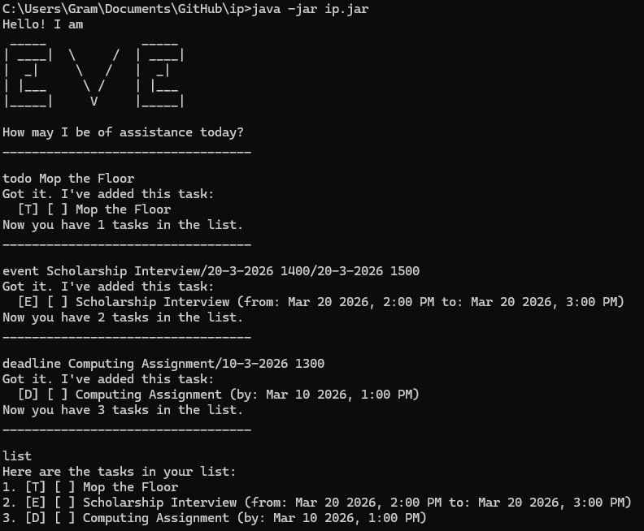

# Eve Task Manager - User Guide

**Eve** is a sleek, text-based chatbot designed to help you manage tasks with precision. Whether you are tracking daily chores, deadlines, or multi-day events, Eve keeps your schedule organized.

---

## Quick Start
1. Ensure you have **Java 17** or above installed.
2. Download the latest `.jar` file.
3. Open a command terminal and run: `java -jar ip.jar`
4. Type your commands into the prompt and press **Enter**.

---

## Features 

### 1. Adding Tasks
Eve supports three types of tasks. Note that dates must follow the `d-M-yyyy HHmm` format.

* **Todo:** A basic task without a date.
  * Command: `todo <description>`
* **Deadline:** A task that needs to be done by a specific time.
  * Command: `deadline <description>/<date time>`
  * Example: `deadline return book/2-12-2019 1800`
* **Event:** A task with a start and end time.
  * Command: `event <description>/<start time>/<end time>`
  * Example: `event project meeting/20-12-2019 1400/20-12-2019 1600`

### 2. Viewing and Finding Tasks
* **List all tasks:** `list`
* **Find by keyword:** `find <keyword>` (e.g., `find book`)

### 3. Managing Task Status
* **Mark as Done:** `mark <index>`
* **Unmark:** `unmark <index>`
* **Delete:** `delete <index>`

### 4. Exiting
* **Exit:** `bye`

---

## Command Summary

| Action | Format |
| :--- | :--- |
| **Add Todo** | `todo <description>` |
| **Add Deadline** | `deadline <desc>/d-M-yyyy HHmm` |
| **Add Event** | `event <desc>/start/end` |
| **List** | `list` |
| **Find** | `find <keyword>` |
| **Delete/Mark** | `<command> <index>` |

## Sample

